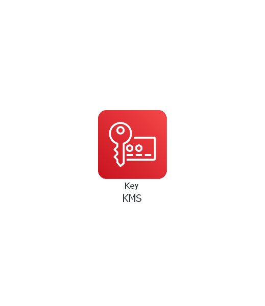

# terraform-aws-kms

[](https://github.com/JamesWoolfenden/terraform-aws-kms)
[](https://github.com/JamesWoolfenden/terraform-aws-kms/releases/latest)
[](https://github.com/JamesWoolfenden/terraform-aws-kms/releases/latest)

[](https://www.bridgecrew.cloud/link/badge?vcs=github&fullRepo=JamesWoolfenden%2Fterraform-aws-kms&benchmark=CIS+AWS+V1.2)
[](https://github.com/pre-commit/pre-commit)
[](https://www.checkov.io/)
[](https://www.bridgecrew.cloud/link/badge?vcs=github&fullRepo=JamesWoolfenden%2Fterraform-aws-kms&benchmark=INFRASTRUCTURE+SECURITY)

---

Terraform module - Create and optionally shares kms key to other accounts.

---

It's 100% Open Source and licensed under the [APACHE2](LICENSE).



## Usage

Include this repository as a module in your existing Terraform code:

```hcl
module "efs" {
  source      = "JamesWoolfenden/kms/aws"
  version     = "v0.0.11"
  common_tags = var.common_tags
  key         = var.key
  user_policy = data.aws_iam_policy_document.kms.json
  alias       = var.alias
}
```

The example in the **examplea** folder shows how to pass your own policy in when creating your key.

If you want to share to other AWS accounts add values to a list called **accounts** to the module reference with the account ids, and set your own values to the map key.

<!-- BEGINNING OF PRE-COMMIT-TERRAFORM DOCS HOOK -->
## Requirements

No requirements.

## Providers

| Name | Version |
|------|---------|
| <a name="provider_aws"></a> [aws](#provider\_aws) | n/a |

## Modules

No modules.

## Resources

| Name | Type |
|------|------|
| [aws_kms_alias.key](https://registry.terraform.io/providers/hashicorp/aws/latest/docs/resources/kms_alias) | resource |
| [aws_kms_key.secure](https://registry.terraform.io/providers/hashicorp/aws/latest/docs/resources/kms_key) | resource |

## Inputs

| Name | Description | Type | Default | Required |
|------|-------------|------|---------|:--------:|
| <a name="input_alias"></a> [alias](#input\_alias) | KMS alias | `string` | `"alias/ami-sharing"` | no |
| <a name="input_common_tags"></a> [common\_tags](#input\_common\_tags) | This is to help you add tags to your cloud objects | `map(any)` | n/a | yes |
| <a name="input_is_enabled"></a> [is\_enabled](#input\_is\_enabled) | n/a | `bool` | `true` | no |
| <a name="input_key"></a> [key](#input\_key) | Details of the key | <pre>object({<br>    description              = string<br>    deletion_window_in_days  = number<br>    key_usage                = string<br>    customer_master_key_spec = string<br>  })</pre> | <pre>{<br>  "customer_master_key_spec": "SYMMETRIC_DEFAULT",<br>  "deletion_window_in_days": 10,<br>  "description": "KMS key 1",<br>  "key_usage": "ENCRYPT_DECRYPT"<br>}</pre> | no |
| <a name="input_user_policy"></a> [user\_policy](#input\_user\_policy) | Allow Key policies to be user supplied | `string` | `""` | no |

## Outputs

| Name | Description |
|------|-------------|
| <a name="output_alias"></a> [alias](#output\_alias) | n/a |
| <a name="output_secure"></a> [secure](#output\_secure) | n/a |
<!-- END OF PRE-COMMIT-TERRAFORM DOCS HOOK -->

## Policy

This is the policy required to build this project:

<!-- BEGINNING OF PRE-COMMIT-PIKE DOCS HOOK -->
The Terraform resource required is:

```golang
resource "aws_iam_policy" "terraform_pike" {
  name_prefix = "terraform_pike"
  path        = "/"
  description = "Pike Autogenerated policy from IAC"

  policy = jsonencode({
    "Version": "2012-10-17",
    "Statement": [
        {
            "Sid": "VisualEditor0",
            "Effect": "Allow",
            "Action": [
                "kms:CreateAlias",
                "kms:CreateKey",
                "kms:DeleteAlias",
                "kms:DescribeKey",
                "kms:DisableKey",
                "kms:EnableKey",
                "kms:EnableKeyRotation",
                "kms:GetKeyPolicy",
                "kms:GetKeyRotationStatus",
                "kms:ListAliases",
                "kms:ListResourceTags",
                "kms:PutKeyPolicy",
                "kms:ScheduleKeyDeletion",
                "kms:TagResource",
                "kms:UntagResource"
            ],
            "Resource": "*"
        }
    ]
})
}


```
<!-- END OF PRE-COMMIT-PIKE DOCS HOOK -->

## Related Projects

Check out these related projects.

- [terraform-aws-s3](https://github.com/jameswoolfenden/terraform-aws-s3) - S3 buckets

## Help

**Got a question?**

File a GitHub [issue](https://github.com/JamesWoolfenden/terraform-aws-kms/issues).

## Contributing

### Bug Reports & Feature Requests

Please use the [issue tracker](https://github.com/JamesWoolfenden/terraform-aws-kms/issues) to report any bugs or file feature requests.

## Copyrights

Copyright © 2019-2022 James Woolfenden

## License

[](https://opensource.org/licenses/Apache-2.0)

See [LICENSE](LICENSE) for full details.

Licensed to the Apache Software Foundation (ASF) under one
or more contributor license agreements. See the NOTICE file
distributed with this work for additional information
regarding copyright ownership. The ASF licenses this file
to you under the Apache License, Version 2.0 (the
"License"); you may not use this file except in compliance
with the License. You may obtain a copy of the License at

<https://www.apache.org/licenses/LICENSE-2.0>

Unless required by applicable law or agreed to in writing,
software distributed under the License is distributed on an
"AS IS" BASIS, WITHOUT WARRANTIES OR CONDITIONS OF ANY
KIND, either express or implied. See the License for the
specific language governing permissions and limitations
under the License.

### Contributors

[![James Woolfenden][jameswoolfenden_avatar]][jameswoolfenden_homepage]<br/>[James Woolfenden][jameswoolfenden_homepage]

[jameswoolfenden_homepage]: https://github.com/jameswoolfenden
[jameswoolfenden_avatar]: https://github.com/jameswoolfenden.png?size=150
